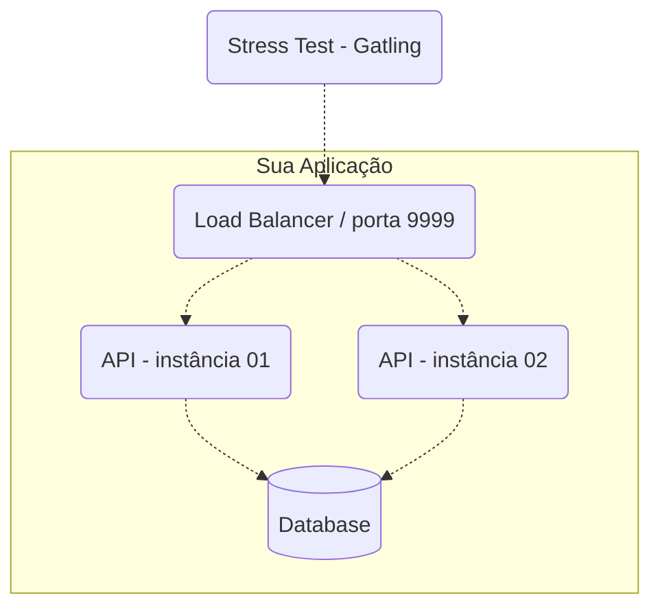

Para rodar este projeto, use o **docker-compose up** 

# Rinha de Backend - 2024/Q1

A Rinha de Backend é um desafio que tem como principal objetivo compartilhar conhecimento em formato de desafio! Esta é a segunda edição. A data limite para enviar sua submissão é `2024-03-10T23:59:59-03:00` e em `2024-03-14T19:00:00-03:00` os resultados serão anunciados [numa live](https://www.youtube.com/watch?v=2OonGBGcl5k) no YouTube.

O principal assunto dessa Rinha trata de controle de concorrência com o tema créditos e débitos (crébitos) e foi inspirado pelos colegas [@lucascs](https://twitter.com/lucascs) e [@kmyokoyama](https://twitter.com/kmyokoyama), [nesse](https://twitter.com/lucascs/status/1744014270331769000) e [nesse](https://twitter.com/kmyokoyama/status/1744018208082760133) comentário [dessa](https://twitter.com/zanfranceschi/status/1743876243815059738) tweet.


Se quiser entender mais sobre o espírito das Rinhas, confira o [repositório da primeira edição](https://github.com/zanfranceschi/rinha-de-backend-2023-q3).

## O Que Precisa Ser Feito?

Para participar você precisa desenvolver uma API HTTP com os seguintes endpoints:

### Transações
**Requisição**

`POST /clientes/[id]/transacoes`
```json
{
    "valor": 1000,
    "tipo" : "c",
    "descricao" : "descricao"
}
```
Onde
- `[id]` (na URL) deve ser um número inteiro representando a identificação do cliente.
- `valor` deve um número inteiro positivo que representa centavos (não vamos trabalhar com frações de centavos). Por exemplo, R$ 10 são 1000 centavos.
- `tipo` deve ser apenas `c` para crédito ou `d` para débito.
- `descricao` deve ser uma string de 1 a 10 caractéres.

Todos os campos são obrigatórios.

**Resposta**

`HTTP 200 OK`
```json
{
    "limite" : 100000,
    "saldo" : -9098
}
```
Onde
- `limite` deve ser o limite cadastrado do cliente.
- `saldo` deve ser o novo saldo após a conclusão da transação.

*Obrigatoriamente, o http status code de requisições para transações bem sucedidas deve ser 200!*

**Regras**
Uma transação de débito **nunca** pode deixar o saldo do cliente menor que seu limite disponível. Por exemplo, um cliente com limite de 1000 (R\$ 10) nunca deverá ter o saldo menor que -1000 (R\$ -10). Nesse caso, um saldo de -1001 ou menor significa inconsistência na Rinha de Backend!

Se uma requisição para débito for deixar o saldo inconsistente, a API deve retornar HTTP Status Code 422 sem completar a transação! O corpo da resposta nesse caso não será testado e você pode escolher como o representar.

Se o atributo `[id]` da URL for de uma identificação não existente de cliente, a API deve retornar HTTP Status Code 404. O corpo da resposta nesse caso não será testado e você pode escolher como o representar. Se a API retornar algo como HTTP 200 informando que o cliente não foi encontrado no corpo da resposta ou HTTP 204 sem corpo, ficarei extremamente deprimido e a Rinha será cancelada para sempre.

## Extrato
**Requisição**

`GET /clientes/[id]/extrato`

Onde
- `[id]` (na URL) deve ser um número inteiro representando a identificação do cliente.

**Resposta**

`HTTP 200 OK`
```json
{
  "saldo": {
    "total": -9098,
    "data_extrato": "2024-01-17T02:34:41.217753Z",
    "limite": 100000
  },
  "ultimas_transacoes": [
    {
      "valor": 10,
      "tipo": "c",
      "descricao": "descricao",
      "realizada_em": "2024-01-17T02:34:38.543030Z"
    },
    {
      "valor": 90000,
      "tipo": "d",
      "descricao": "descricao",
      "realizada_em": "2024-01-17T02:34:38.543030Z"
    }
  ]
}
```
Onde
- `saldo`
    - `total` deve ser o saldo total atual do cliente (não apenas das últimas transações seguintes exibidas).
    - `data_extrato` deve ser a data/hora da consulta do extrato.
    - `limite` deve ser o limite cadastrado do cliente.
- `ultimas_transacoes` é uma lista ordenada por data/hora das transações de forma decrescente contendo até as 10 últimas transações com o seguinte:
    - `valor` deve ser o valor da transação.
    - `tipo` deve ser `c` para crédito e `d` para débito.
    - `descricao` deve ser a descrição informada durante a transação.
    - `realizada_em` deve ser a data/hora da realização da transação.

**Regras**
Se o atributo `[id]` da URL for de uma identificação não existente de cliente, a API deve retornar HTTP Status Code 404. O corpo da resposta nesse caso não será testado e você pode escolher como o representar. Já sabe o que acontece se sua API retornar algo na faixa 2XX, né? Agradecido.


## Cadastro Inicial de Clientes
Para haver ênfase em concorrência durante o teste, poucos clientes devem ser cadastrados e testados. Por isso, apenas cinco clientes, com os seguintes IDs, limites e saldos iniciais, devem ser previamente cadastrados para o teste – isso é imprescindível!

| id | limite | saldo inicial
| - | - | -
| 1 | 100000 | 0
| 2 | 80000 | 0
| 3 | 1000000 | 0
| 4 | 10000000 | 0
| 5 | 500000 | 0

Obs.: Não cadastre um cliente com o ID 6 especificamente, pois parte do teste é verificar se o cliente com o ID 6 realmente não existe e a API retorna HTTP 404!


### <a name="arquitetura">Arquitetura Mínima da API</a>
Por "API" aqui, me refiro a todos os serviços envolvidos para que o serviço que atenderá às requisições HTTP funcione, tais como o load balancer, banco de dados e servidor HTTP.

A sua API precisa ter, no mínimo, os seguintes serviços:
- Um **load balancer** que faça a distribuição de tráfego usando o algoritmo round robin. Diferentemente da edição anterior, você não precisa usar o Nginx – pode escolher (ou até fazer) qualquer um como p.ex. o HAProxy. **O load balancer será o serviço que receberá as requisições do teste e ele precisa aceitar requisições na porta 9999**!
- **2 instâncias de servidores web** que atenderão às requisições HTTP (distribuídas pelo load balancer).
- Um banco de dados relacional ou não relacional (exceto bancos de dados que têm como principal característica o armazenamento de dados em memória, tal como Redis, por exemplo).



**Nota**: Você pode usar componentes adicionais se quiser. Mas lembre-se de que as restrições de CPU e memória devem obedecer a regra de que a soma dos limites (que devem ser declarados para todos os serviços) não poderá ultrapassar 1.5 unidades de CPU e 550MB de memória! Use o bom senso e boa fé, não adicione um banco relacional e um Redis, por exemplo, e use apenas o Redis como armazenamento – afinal, a Rinha é apenas uma brincadeira que fomenta o aprendizado e não a competição desleal.

